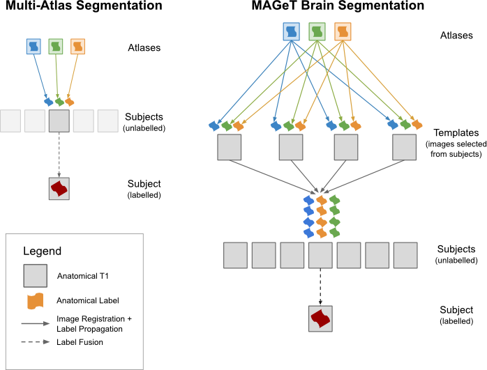

# Multiple Automatically Generated Templates brain segmentation algorithm

Given a set of labelled MR images (atlases) and unlabelled images (subjects), MAGeT produces a segmentation for each subject using a multi-atlas voting procedure based on a template library made up of images from the subject set.  

Here is a schematic comparing 'traditional' multi-atlas segmentation, and MAGeT brain segmentation: 



The major difference between algorithms is that, in MAGeT brain, segmentations from each atlas (typically manually delineated) are propogated via image registration to a subset of the subject images (known as the 'template library') before being propogated to each subject image and fused. It is our hypothesis that by propogating labels to a template library, we are able to make use of the neuroanatomical variability of the subjects in order to 'fine tune' each individual subject's segmentation. 

## For the impatient (Really quick start) 

    git clone http://pipitone.github.com/MAGeTbrain
    export PATH=$PWD/MAGeTBrain/bin:$PATH
    mb init segmentation
    # populate the segmentation/input folder
    mb check
    mb run

## Quick start

0. Check out a copy of this repository somewhere handy,
    
        git clone  git://github.com/pipitone/MAGeTbrain.git 

1. Add the `bin` folder to your path. Create a new folder for your project and, 

        mb init

2. Copy/link your atlases, templates, subjects into `input/atlases`,
   `input/templates`, and `input/subjects`, respectively.  As per always, MR
   images go in `brains` and corresponding labels go in `labels`.  Labels should
   have the same name as the MR image but with a postfix of `_labels.mnc`.

3. MAGeT Brain is operated using the ```mb``` command. In order to run the
   entire pipeline, simply run: 

        mb run

   This uses the default settings to execute the necessary commands. In
   particular, it assumes you have access to a PBS batch queuing system, and
   uses the utility ```bin/qbatch``` to submit commands in batches.  If you are
   running this on SciNet, you should no problems.

   If you can also run MAGeT Brain using the GNU parallel on a single machine, 
   like so: 

        mb run -q parallel

    
Currently, only majority voting label fusion is enabled.  For a more complete
implementation, check the 'master' branch. 

---
    http://tinysong.com/y9lO
